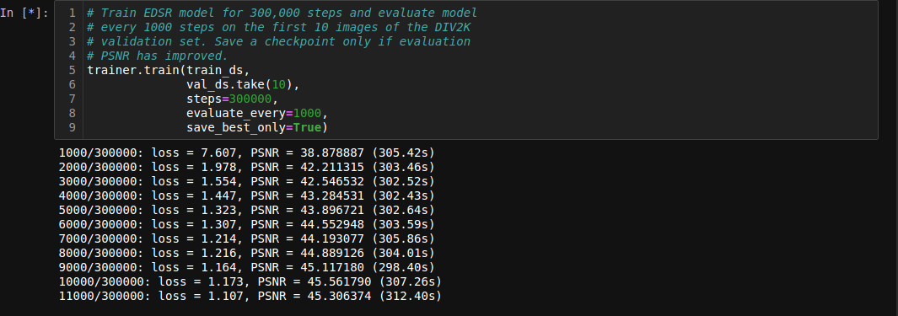
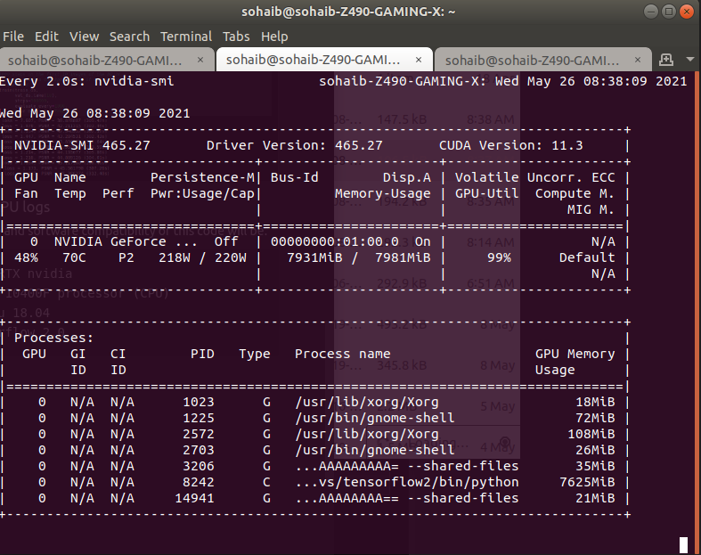
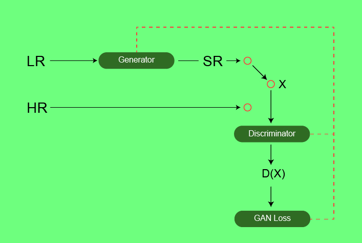
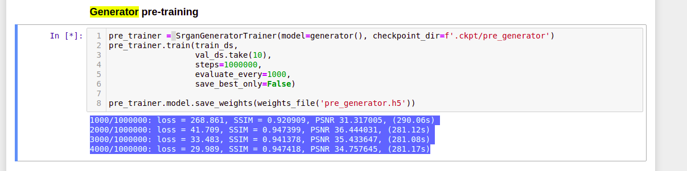
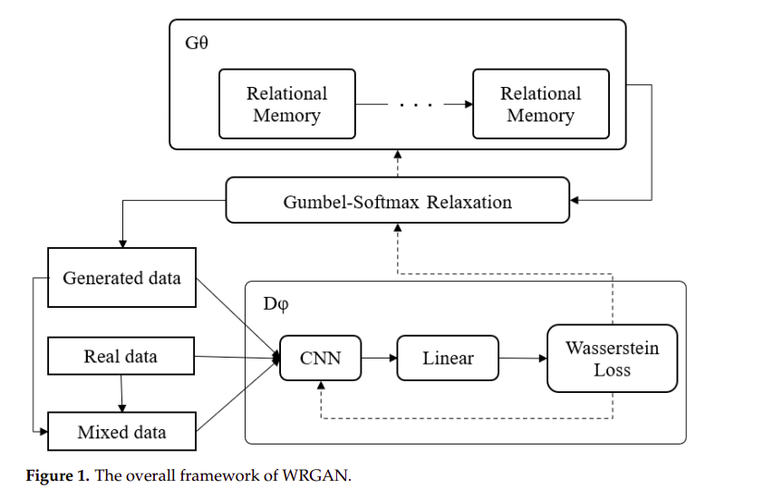

# Make your image better with this git
With the help of this git you are able to train your own custom dataset on EDSR or SR-Gans
These two algorithms are used for super resolution. which will convert your (150 * 150) px image to (600 * 600) image. In case you are not able to understand things email me or comment below. I will fix that issue out. Thank you

# Dataset

1. Download the dataset from Gdrive

        https://drive.google.com/drive/folders/1zKEvX3ubm19kHdWFQEpD6T-0NlCE6opp?usp=sharing

2. Training of Edsr

        This notebook help you in training edsr on your custom dataset like I used brain mris. I got images with 600 by 600 diminsion, Firstly I downsize them by 2x factor (300,300) now I got my low resoltion images as well as high resolution images, than I just feed them edsr model to make an image with diminsion (300,300) to (600, 600)

# Edsr model 

### Images I used for the training purpose

### Training Logs

### Nvidia GPU logs

# SR-Gans

**Super Resolution GAN (SRGAN)**

SRGAN was proposed by researchers at Twitter. The motive of this architecture is to recover finer textures from the image when we upscale it so that it’s quality cannot be compromised. There are other methods such as Bilinear Interpolation that can be used to perform this task but they suffer from image information loss and smoothing. In this paper, the authors proposed two architectures the one without GAN (SRResNet) and one with GAN (SRGAN). It is concluded that SRGAN has better accuracy and generate image more pleasing to eyes as compared to SRGAN.

Architecture: Similar to GAN architectures, the Super Resolution GAN also contains two parts Generator and Discriminator where generator produces some data based on the probability distribution and discriminator tries to guess weather data coming from input dataset or generator.  Generator than tries to optimize the genrated data so that it can fool the discriminator. Below are the generator and discriminator architectural details:

## Artitecture

## Loss Function SSRGANS:

The SRGAN uses perpectual loss function (LSR)  which is the weighted sum of two loss components : content loss and adversarial loss. This loss is very important for the performance of the generator architecture:

Content Loss: We use two types of content loss in this paper : pixelwise MSE loss for the SRResnet architecture, which is most common MSE loss for image Super Resolution. However MSE loss does not able to deal with high frequency content in the image that resulted in producing overly smooth images. Therefore the authors of the paper decided to  use loss of different VGG layers. This VGG loss is based on the ReLU activation layers of the pre-trained 19 layer VGG network. This loss is defined as follows

**Adversarial Loss:** The Adversarial loss is the loss function that forces the generator to image more similar to high resolution image by using a discriminator that is trained to differentiate between high resolution and super resolution images.

## Training Results:

# WRGans (Wasserstein distance)

For GAN models that were not designed for text generation, we will first introduce a
distance measurement method called “Earth-Mover (also called Wasserstein) distance”,
W(q, p), which is informally defined as the minimum cost of transporting mass in order
to transform the distribution q into the distribution p (where the cost is the mass times
the transport distance). Under mild assumptions, W(q, p) is continuous everywhere
and differentiable almost everywhere [10]. The “Earth-Mover distance” W(q, p) can be
defined as:

W(q, p) = min
γ
E(q,p)∼γkq − pk, (1)

where γ is a probability distribution that satisfies the constraints:

Z
γ(q, p)dq = Pg(q),

Z
γ(q, p)dp = Pf
(p). (2)

Instead, WGAN was proposed to use the Wasserstein distance as the loss to solve
the unstable problem in GAN training. WGAN theoretically points out the defects of
the original GAN. WGAN-GP was used to propose another truncation pruning strategy—
“gradient penalty”—to make the training process more stable and achieve higher-quality
generation results. The f-GAN [22] used variable dispersion to minimize the training of a
generative adversarial network of generative neural samplers. These methods also have
reference values for text generation.

# Conclusions
As from the numbers of validation losses computed while training. Edsr is performing better than SRGans. From the results of wrgans I realised that it is still instable but its really
an improved version REL-Gan. It takes a lot of GPU to memory to train. 1 batch size of (300* 300) image at a time to train its really expensive and its epoch takes 4 min on nvidia 3070. 

# Hardware and software compatibility.

    3070 RTX nvidia
    Intel 10400F processor (CPU)
    Ubuntu 18.04
    tensorflow 2.0

# Things to do

1. Will merge more models 
2. Fuse multiple model weights into one

# Took Help from 

1. Edsr Git https://github.com/krasserm/super-resolution
2. Tensorflow Documentation
3. Stack Overflow https://stackoverflow.com/users/7959545/sohaib-anwaar
4. Geeks for Geeks https://www.geeksforgeeks.org/super-resolution-gan-srgan/
5. WRGans Research Paper https://www.researchgate.net/publication/348753509_WRGAN_Improvement_of_RelGAN_with_wasserstein_loss_for_text_generation

**Git Progress:**
          
          v.0.0
          1. Researched about esdr
          2. Understanding of the code
          3. Change the data.py file (Data generator)
          
          v0.1
          1. Training of edsr on custom dataset (I used Medical Imaging dataset you can find data below in gdrive.)

          v0.2
          1. Researching on SR-gans
          2. Implementation and training of sr-gans

          v0.3
          1. Research on WR_Gans
          2. Implementation and Training of Wr-Gans
          3. Validatipn of WR_Gans
          
